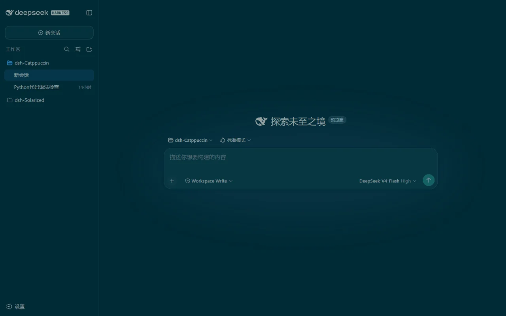
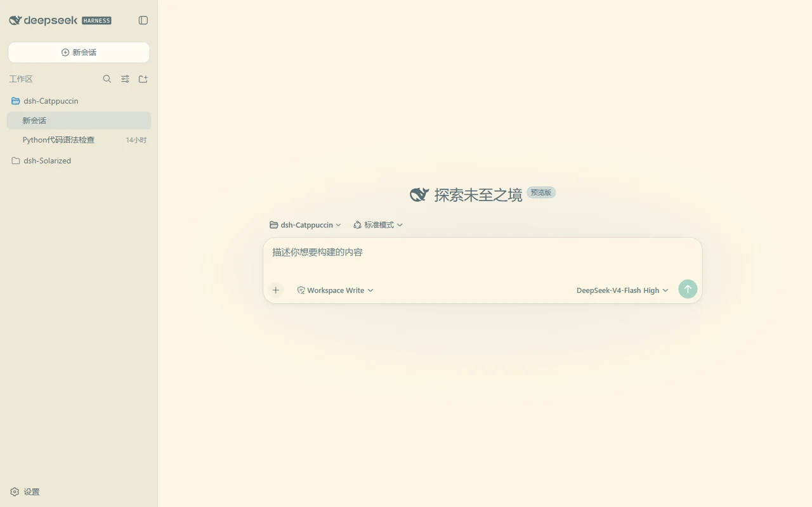
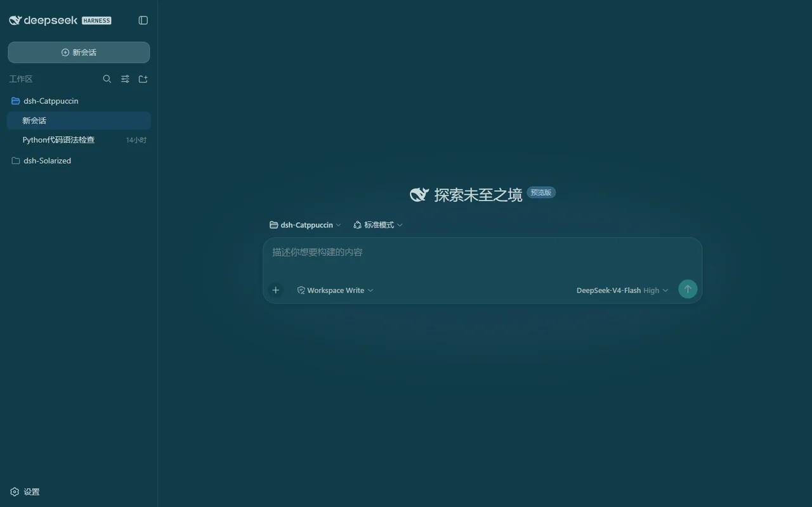
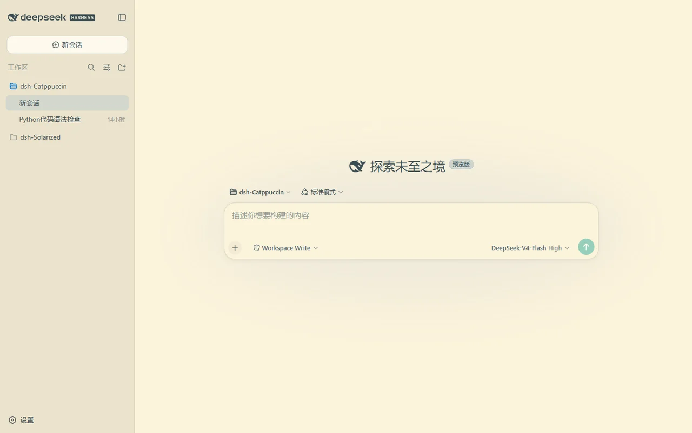

<h3 align="center">
	<br/>
	
	Solarized + Selenized for <a href="https://github.com/deepseek-ai/deepseek-harness">DeepSeek Harness</a>
	
</h3>

<p align="center">
	<a href="https://github.com/zhijun-dai/Solarized-dsh-theme/stargazers"></a>
	<a href="https://github.com/zhijun-dai/Solarized-dsh-theme/issues"></a>
	<a href="https://github.com/zhijun-dai/Solarized-dsh-theme/contributors"></a>
	<a href="https://www.npmjs.com/package/@yuquexianzhou/solarized-dsh-theme"></a>
</p>

<p align="center">
	English | <a href="README.zh.md">中文</a>
</p>

<p align="center">
	
</p>

## Previews

<details>
<summary>☀️ Solarized Dark</summary>

</details>
<details>
<summary>🌞 Solarized Light</summary>

</details>
<details>
<summary>🌗 Selenized Dark</summary>

</details>
<details>
<summary>🌕 Selenized Light</summary>

</details>

## Usage

This is a dual-face theme plugin for [DeepSeek Harness](https://github.com/deepseek-ai/deepseek-harness)
(dsh). It registers four faithful palettes into the built-in theme runtime, so
they appear as selectable skins in **Settings → General → Solarized / Selenized
themes**.

[Solarized](https://github.com/altercation/solarized) is a precision color
scheme by Ethan Schoonover (2011), designed in the CIELAB (L\*a\*b\*) color
space with fixed, perceptually uniform lightness relationships between its
sixteen colors — the science that keeps its dark and light modes mutually
symmetric. [Selenized](https://github.com/jan-warchol/selenized), by Jan
Warchoł (2018), is Solarized redesigned: it corrects the palette's lightness
inconsistencies while keeping its spirit.

### Install

From a GitHub repository:

```sh
dsh plugin --profile web add github:zhijun-dai/Solarized-dsh-theme
```

From a local checkout (the `-w` flag is required — the profile directory is a
pnpm workspace root):

```sh
dsh plugin --profile web add -w /path/to/Solarized-dsh-theme
```

From npm:

```sh
dsh plugin --profile web add @yuquexianzhou/solarized-dsh-theme
```

Restart the web server afterwards:

```sh
dsh web
```

### Switch themes

Open the web UI, go to **Settings → General**, and pick one of the four themes
(or **Default** to follow the built-in appearance). The choice is stored
per-browser in `localStorage`.

## How it works

The token tables are generated from the official Solarized and Selenized
palettes (never hand-edited). `scripts/gen-client.mjs` maps every color onto
the `--dsw-alias-*` token directory from dsh's
`@deepseek-ai/dsh-client-ui-theme` stylesheets (including the `--shiki-*`
syntax palette and the leaked `--dsw-static-deepseek-*` static colors) and
embeds the four themes into the browser bundle `lib/client.js`.

```sh
node scripts/gen-client.mjs
```

## 💝 Thanks to

- [zhijun-dai](https://github.com/zhijun-dai)
- [Ethan Schoonover](https://github.com/altercation) — Solarized
- [Jan Warchoł](https://github.com/jan-warchol) — Selenized
- [KinGao294/dsh-skin](https://github.com/KinGao294/dsh-skin) — the reference theme plugin this port is modeled on
- [DeepSeek](https://github.com/deepseek-ai)

&nbsp;

<p align="center">
	
</p>

<p align="center">
	Copyright &copy; 2026-present <a href="https://github.com/zhijun-dai" target="_blank">zhijun-dai</a>
</p>

<p align="center">
	<a href="https://github.com/zhijun-dai/Solarized-dsh-theme/blob/main/LICENSE"></a>
</p>
